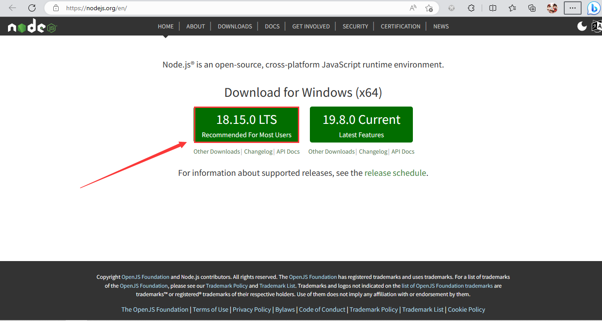
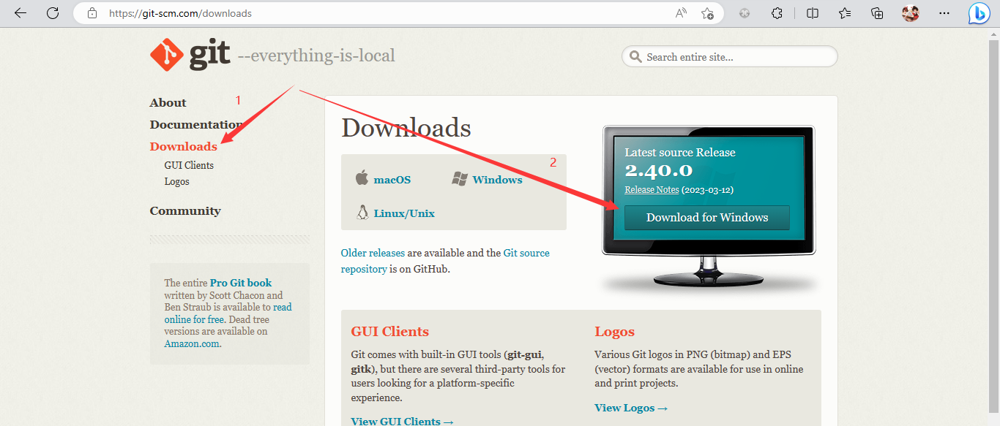
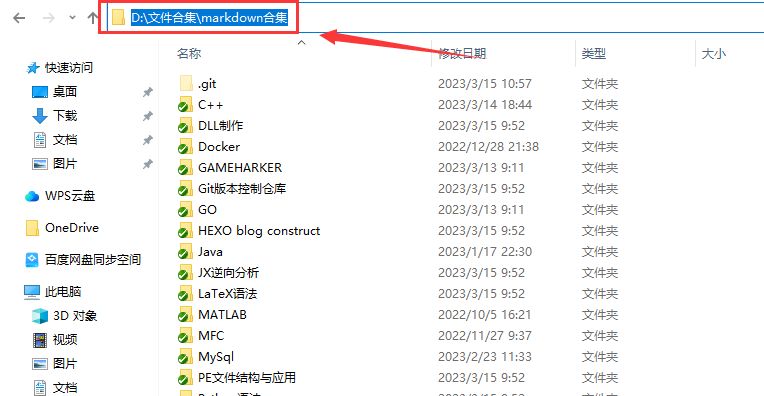
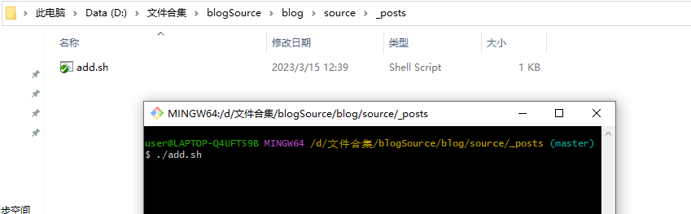
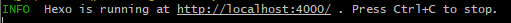
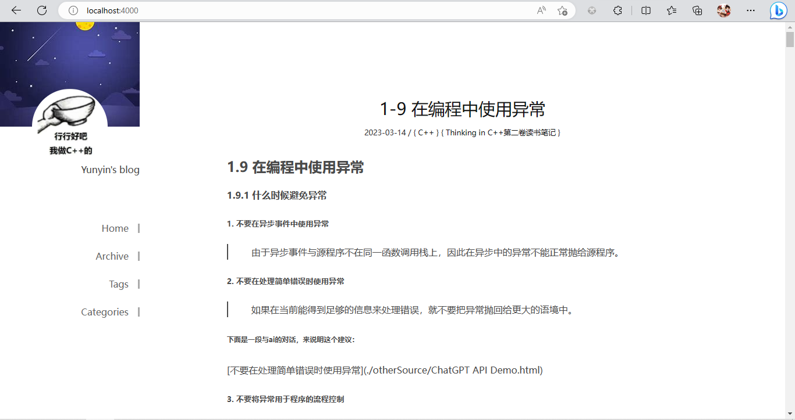

# FastHexo

> 一个快速将大量markdown笔记移植到hexo博客下的框架。

## 简介

* 项目由来：对于长期使用typora写作的同学，若想将大量markdown笔记（几百篇）一次性部署到hexo上，只能逐个逐个加上hexo规定的title、date、tags、categories...同时hexo配置也十分繁琐，坑点众多。如果切换设备又需要重新配置。
* 解决方案：本项目提供一个默认的方案，帮助哪些不了解前端，长期使用typora做笔记的后端同学，快速上手hexo的笔记，批量转换笔记仓库，做到一步完成博客生成。

## 效果

* 自动为无hexo格式开头的markdown生成符合hexo的读取方式
* 不符合YAML格式文档会被保存到错误日志以便于更改
* 添加`<!--more-->`以提升Home阅读体验

演示Demo：[云隐的个人博客](https://life-studied.github.io)

## 依赖

* [Node.js (nodejs.org)](https://nodejs.org/zh-cn/download/)
* [Git](https://git-scm.com/downloads)
* hexo-enhancer插件（本框架已配置）

## 使用

### 1.安装上述依赖

#### nodejs

* 进入官网，下载左边的，一路`next`



#### Git

* 进入官网，点击左边的`Downloads`
* 再点击右边的`Download for Windows`，一路next



### 2.笔记仓库

* 先将本仓库`clone`至本地

```shell
git clone https://github.com/life-studied/mdFast2hexo.git
```

**注：**如果你的笔记仓库在本地，请按照下面步骤1，如果在Github等云端按照步骤2。

#### 1.本地笔记直接使用

* 将你的本地笔记仓库根目录的绝对路径复制



* 在`source/_posts/add.sh`中，将源地址改为你的笔记地址

* 在上述目录的`gitbash`环境下运行`add.sh`脚本



* 错误信息日志地址：`source/log.txt`，正确的文件会被渲染

#### 2.远程笔记仓库使用

* 将你的远程笔记仓库clone到本地
* 将shell目录下的rewrite.sh脚本复制到你的本地笔记仓库目录下
* 在gitbash环境下执行该脚本
* 剩下步骤请至**本地仓库使用**教程

### 3.安装HEXO

* 在项目仓库中打开bash，安装hexo环境

```shell
npm install hexo-cli -g
```

### 4.生成网页

在框架目录的gitbash下执行下面的命令，该命令会根据markdown笔记生成网页，并将其部署在本地4000端口，生成后你应当能在浏览器的`localhost:4000`下访问到该网页。

```shell
hexo g
hexo s
```



在浏览器的本地4000端口，可以看见markdown已经被转换为博客网页。



### 5.一些细节

* 虽然笔记已经完成部署了，但是你的用户名，网页名等还没改，下面是完成这些细节的步骤。

（此处未完成，后续更新）

## 远程部署

* 推荐使用Github Page，详见hexo官网（注意：千万不要在访问你的*.github.io网站时使用加速器！）

## 注意事项

* 确保你的笔记文件树较为严格地划分了你的不同类别的笔记：本框架使用hexo-enhancer插件生成categories和tags。
* 主题默认采用icalm，客制化主题请访问hexo官网的theme页面
* 不要混用该框架与你自己原有的hexo博客，或是将脚本处理后的markdown文件复制到你的目录下，因为两者生成date的方式并不一致

## 其它配置

见hexo官网

